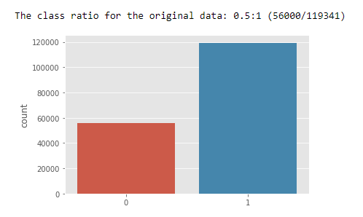
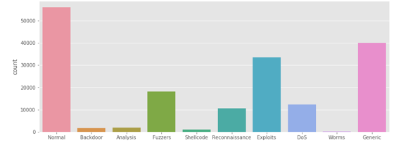
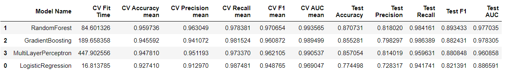
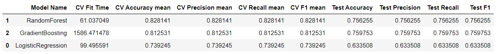
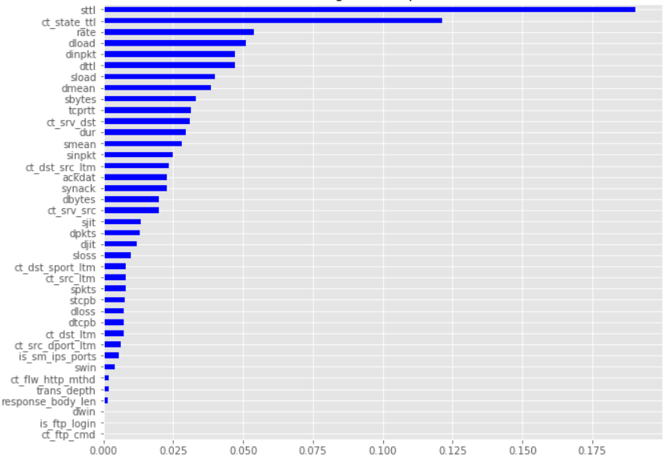
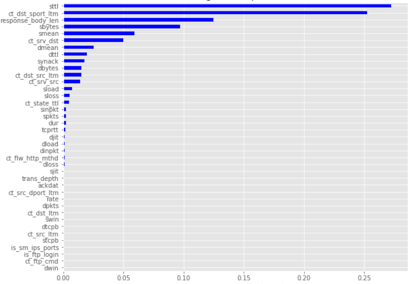

# IoT-Intrusion-Detection

## Plamen Dzhelepov
[Linkedin](https://www.linkedin.com/in/pdzhelepov) | [Github](https://github.com/plamengj)

## Table of Contents

* [Overview and Motivation](#overview-and-motivation)
* [Data](#data)
  * [Data Preprocessing](#data-preprocessing)
  * [EDA](#eda)
<!-- * [Exploration](#exploration) -->
* [Modeling](#modeling)
* [Conclusion](#conclusion)

## Overview and Motivation
IoT networks have become an increasingly valuable target of malicious attacks due to the increased amount of valuable user data they contain. In response, network intrusion detection systems have been developed to detect suspicious network activity.
Moreover, IoT traditional network security solutions may not be directly applicable due to the differences in IoT structure and behavior. IoT devices offer low operating energy and minimal computational capabilities. Therefore security mechanism such as encryption protocols and authentication can not be directly applied. Last but not least, The lack of a single standard for IoT architecture. IoT systems may have different policies, and connectivity domains.

## Data
### Description
UNSW-NB15 is an IoT-based network traffic data set with different categories for normal activities and malicious attack behaviors. 

The raw network packets of the UNSW-NB 15 dataset was created by the IXIA PerfectStorm tool in the Cyber Range Lab of the Australian Centre for Cyber Security (ACCS) for generating a hybrid of real modern normal activities and synthetic contemporary attack behaviours.

Tcpdump tool is utilised to capture 100 GB of the raw traffic (e.g., Pcap files). This dataset has nine types of attacks, namely, Fuzzers, Analysis, Backdoors, DoS, Exploits, Generic, Reconnaissance, Shellcode and Worms. The Argus, Bro-IDS tools are used and twelve algorithms are developed to generate totally 49 features with the class label.

A partition from this dataset is configured as a training set and testing set, namely, UNSW_NB15_training-set.csv and UNSW_NB15_testing-set.csv respectively.

The number of records in the training set is 175,341 records and the testing set is 82,332 records from the different types, attack and normal.Figure 1 and 2 show the testbed configuration dataset and the method of the feature creation of the UNSW-NB15, respectively.

## Data Preprocessing
CSV processed with Pandas, NumPy, skitLearn, then NaN`s were removed. The data was split into training and testing set. And then finally I did some Encoding Transformation.

Then I decided to look into attack or not classification and attack type classification, and select the best model for each.

<!-- ## Exploration
This section contains plots that demonstrate the types of information that can be gleaned from this data set.

This is a heatmap of the correlation matrix and it shows how the features are correlated with each other and with the target.

 -->

## EDA

This dataset has nine types of attacks: Fuzzers, Analysis, Backdoors, DoS, Exploits, Generic, Reconnaissance, Shellcode and Worms. s

The ratio of benign to malicious packets is 1:2 in the dataset.

## Modeling
Determine which model should be used to classify category attacks and intrusions detection on IoT networks. Also discover relevant features for model inspection.

Based on the f1 cross-validation score of both classifications, I chose as my model the Random forest and scored it on the testing set. 

These are the feature importances for attack or not classification:

And these are the feature importances for the attack type classification:

<!-- And the confusion matrix:

 -->

F1 score (weighted average of the precision and recall) is the primary evaluation metric on testing data to show the performance of the trained model. The Random Forest model marginally outperformed the other model in both classificati9ons. 

## Conclusion
UNSW-NB15 botnet datasets with IoT sensors' data are used to obtain results that show that the proposed features have the potential characteristics of identifying and classifying normal and malicious activity. The eole of the ML algorithms is for developing a network forensic system based on network flow identifiers and features that can track suspicious activities of botnets is possible. Furthermore, Random Forest model provides a higher detection rate, accuracy and a lower false positive rate compared with both classification responses. The ML model metrics using the UNSW-NB15 dataset revealed that ML techniques with flow identifiers can effectively and efficiently detect botnets’ attacks and their tracks.